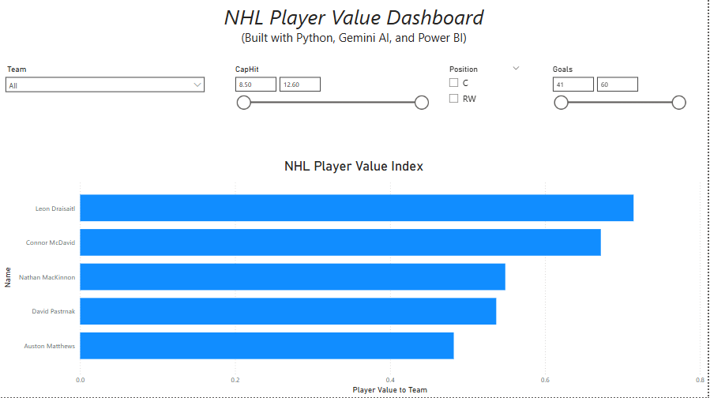
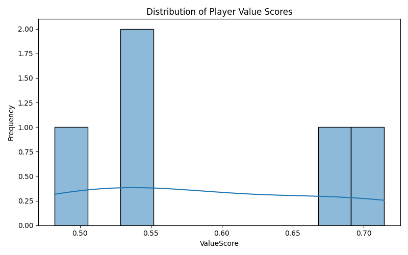
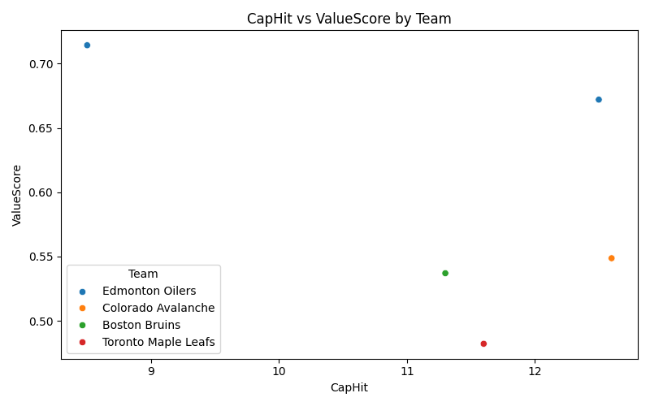
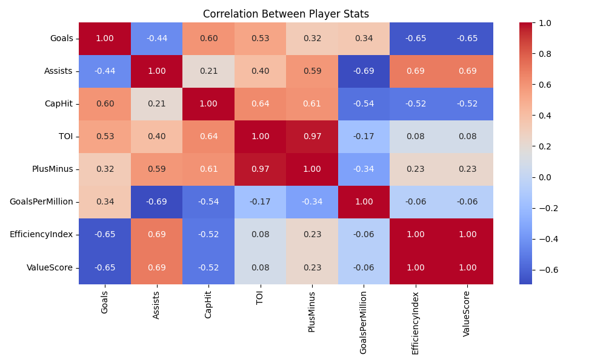

# 🏒 NHL Player Value Analysis — Python + Power BI + Gemini AI

This project analyzes and visualizes the **true on-ice value of NHL skaters** based on a custom metric called `ValueScore`, derived from goals, assists, cap hit, time on ice, and plus-minus ratings.

Combining Python, Gemini AI, and Power BI, the system ranks players by cost-efficiency and performance impact — helping identify underpaid stars and overpaid contracts.

---

## 🔧 Features

- ✅ Clean and process player stats from CSV  
- ✅ Compute advanced metrics (`ValueScore`, `EfficiencyIndex`, `GoalsPerMillion`)  
- ✅ Auto-generate AI summaries with Gemini Flash  
- ✅ Export to Power BI for interactive filtering  
- ✅ Visual EDA: scatter plots, histograms, heatmaps  
- ✅ PDF/report-ready insights and markdown summaries  

---

## 📊 Key Metrics

| Metric             | Description                                       |
|--------------------|---------------------------------------------------|
| `ValueScore`       | Weighted combo of cost-efficiency, output, plus-minus |
| `EfficiencyIndex`  | Points per minute played                          |
| `GoalsPerMillion`  | Goals per $1M cap hit                             |

---

## 📁 Folder Structure

```
nhl_value_analysis/
├── data/                # Raw and processed NHL skater data
├── src/                 # Python modules: model, summarizer, loader
├── outputs/
│   ├── summaries/       # AI-generated summaries (markdown)
│   └── graphs/          # Saved charts (scatter, hist, heatmap)
├── notebooks/           # EDA.ipynb: Visual exploration & stat insights
├── dashboards/          # Power BI file (.pbix) + README
├── insights/            # Executive summary folder (optional)
├── run_all.py           # Full pipeline runner (load → score → summarize)
├── requirements.txt     # Python dependencies
└── README.md            # You are here
```

---

## 📈 Visual Examples

### 📊 Power BI Dashboard Overview


### 📈 Value Score Distribution


### 💰 Cap Hit vs Value Score


### 🔥 Player Stat Correlations



### 🔹 Power BI Dashboard
- Filter by Team, Position, Goals, CapHit  
- View ranked `ValueScore` bar charts  
- Drill into underpaid player contracts  

### 🔹 Notebook Graphs
- Distribution of `ValueScore`  
- Scatterplot: CapHit vs ValueScore  
- Heatmap of player stat correlations  

---

## 🚀 Quickstart

```bash
# Step 1: Install dependencies
pip install -r requirements.txt

# Step 2: Run the full pipeline (optional)
python run_all.py
```

---

## 📦 Tools Used

- **Python** – Data prep, scoring  
- **Gemini 1.5 Flash** – Summary generation (via `google-generativeai`)  
- **Power BI Desktop** – Final dashboard  
- **Matplotlib & Seaborn** – Graphs from `EDA.ipynb`  

---

## 🧠 Real-World Use Case

> This project simulates what a professional hockey analyst, scout, or recruiter would use to rank talent across teams and contracts — adjusted for salary efficiency.

---

## 👤 Author

Developed by **Yuvraj Bains** — Software Engineering @ Carleton University  
